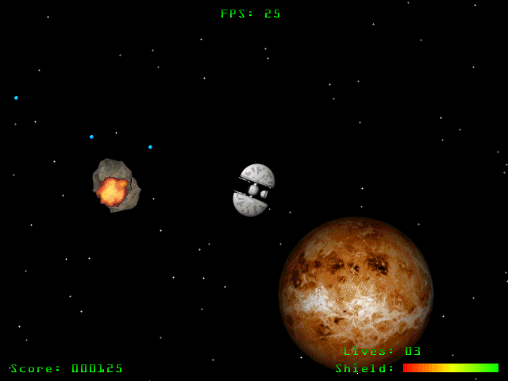



## Asteroidz

### Description

Complete game using Object Oriented Programming (OOP). Easy functionality, not optimized, so the code should be fairly easy to understand. Also implements Polymorphism, something rarely found in VB. Uses BitBlt (contained in a bitmap handler class), SndPlaySound (contained in a sound handler class), Enumerated keyboard input class and much more (please view the readme file). Any votes and/or comments would be greatly appreciated.
 
### More Info
 
You should have a basic knowlege of classes and objects, and the windows api (though my program hides most of the api stuff).

I am hoping none, :)

             |
---                |---
**Submitted On**   |2002-06-30 09:51:46
**By**             |[Hyper\-Gamma Software](https://github.com/Planet-Source-Code/PSCIndex/blob/master/ByAuthor/hyper-gamma-software.md)
**Level**          |Intermediate
**User Rating**    |5.0 (20 globes from 4 users)
**Compatibility**  |VB 6\.0
**Category**       |[Games](https://github.com/Planet-Source-Code/PSCIndex/blob/master/ByCategory/games__1-38.md)
**World**          |[Visual Basic](https://github.com/Planet-Source-Code/PSCIndex/blob/master/ByWorld/visual-basic.md)
**Archive File**   |[Asteroidz100570712002\.zip](https://github.com/Planet-Source-Code/hyper-gamma-software-asteroidz__1-36434/archive/master.zip)

### API Declarations

All contained in the class modules

